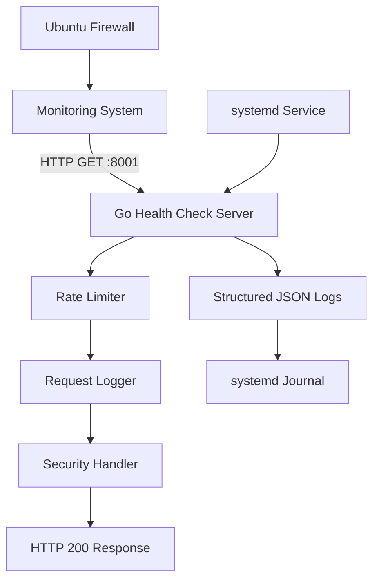

# VPS Health Check Server - Implementation Plan

## Overview
This document outlines the complete plan for implementing a secure, lightweight web server for VPS health monitoring using Go, designed to run as a systemd service on Ubuntu.

## System Architecture



## Technical Specifications

### Server Requirements
- **Language**: Go 1.19+
- **Port**: 8001
- **Response**: HTTP 200 OK with "OK" body
- **Memory**: < 50MB
- **Deployment**: Single binary

### Security Features
- Rate limiting (10 requests/minute per IP)
- Security headers (X-Content-Type-Options, X-Frame-Options, X-XSS-Protection)
- Input validation and sanitization
- Structured logging to prevent log injection

### Logging Format
```json
{
  "timestamp": "2023-12-13T04:43:00Z",
  "level": "info",
  "message": "Health check request processed",
  "ip": "192.168.1.100",
  "user_agent": "Mozilla/5.0...",
  "response_time_ms": 2
}
```

## Implementation Structure

### Files to Create
1. `main.go` - Main server implementation
2. `health-check.service` - systemd service file
3. `README.md` - Deployment and usage documentation
4. `SECURITY.md` - Security hardening guidelines
5. `go.mod` - Go module definition

### Key Components
- HTTP server with timeout configurations
- Rate limiting middleware
- Structured JSON logger
- Graceful shutdown handling
- Security headers middleware

## Deployment Process

1. **Build Phase**
   - Cross-compile Go binary for Ubuntu
   - Verify binary functionality

2. **Setup Phase**
   - Copy binary to `/usr/local/bin/`
   - Create systemd service file
   - Configure firewall rules

3. **Service Phase**
   - Enable and start systemd service
   - Verify logging integration
   - Test health check endpoint

## Security Considerations

### Network Security
- Firewall configuration for port 8001
- Rate limiting to prevent DoS attacks
- Connection timeouts

### Application Security
- Input sanitization
- Security headers
- Structured logging to prevent injection
- Minimal attack surface (single endpoint)

### Operational Security
- Non-root user execution
- Log monitoring and retention
- Regular security updates

## Monitoring and Maintenance

### Health Monitoring
- systemd service status
- Log analysis for unusual patterns
- Response time monitoring
- Error rate tracking

### Maintenance Tasks
- Regular Go updates
- Security patch application
- Log rotation configuration
- Performance monitoring

## Next Steps

The architectural planning is complete. The remaining implementation tasks are:

1. **Implementation Phase** - Write the Go server code
2. **Service Configuration** - Create systemd service file
3. **Documentation** - Write deployment and security guides
4. **Testing** - Validate functionality and security
5. **Deployment** - Deploy to Ubuntu VPS

This plan ensures a secure, maintainable, and reliable health monitoring solution for your VPS infrastructure.